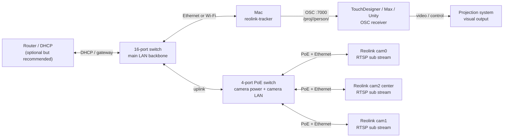
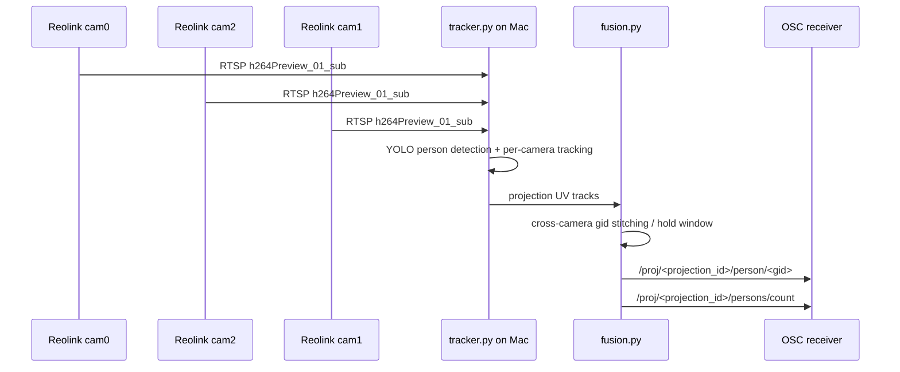

# Network topology

This document describes the recommended field wiring when using a 16-port
switch plus a 4-port PoE switch for Reolink RTSP tracking.

It intentionally avoids fixed camera IPs, RTSP credentials, and venue-specific
addresses. Keep those in local `config.yaml` only.

## Recommended physical layout

Use the 16-port switch as the main network backbone. Use the 4-port PoE switch
only for camera power and camera network access, then uplink it to the 16-port
switch with one Ethernet cable. This keeps the cameras, the tracker Mac, and
the OSC receiver on one reachable LAN.

## Signal flow

## Cabling checklist

- Connect all Reolink cameras to the PoE switch.
- Connect the 4-port PoE switch uplink to the 16-port switch.
- Connect the Mac running `tracker.py --show` to the same 16-port switch, or to
  the same router LAN via Wi-Fi if latency is acceptable.
- Connect the OSC receiver machine to the same LAN. If TouchDesigner runs on the
  same Mac, keep `osc.host: 127.0.0.1`.
- If TouchDesigner runs on another machine, set `osc.host` in local
  `config.yaml` to that machine's LAN IP.
- Keep all camera RTSP URLs in local `config.yaml`; do not copy them into docs.

## Field checks

1. Open `tracker.py --show` and switch to the `lan` page with `Tab`.
2. Confirm the camera hosts appear reachable from the Mac.
3. Confirm every camera resolves through the expected Ethernet/Wi-Fi interface.
4. Confirm the viewer shows `overlap: 0` for dispatch slices.
5. Confirm OSC updates arrive at the receiver on the configured port, usually
   `7000`.

## Common wiring mistakes

- PoE switch is powered but its uplink is not connected to the 16-port switch.
- Cameras are on the PoE switch, but the Mac is on a different subnet.
- Router/DHCP is missing, so cameras keep old addresses or self-assigned
  addresses.
- TouchDesigner is on another machine, but `osc.host` still points to
  `127.0.0.1`.
- RTSP uses the main stream instead of the low-latency H.264 sub stream.
